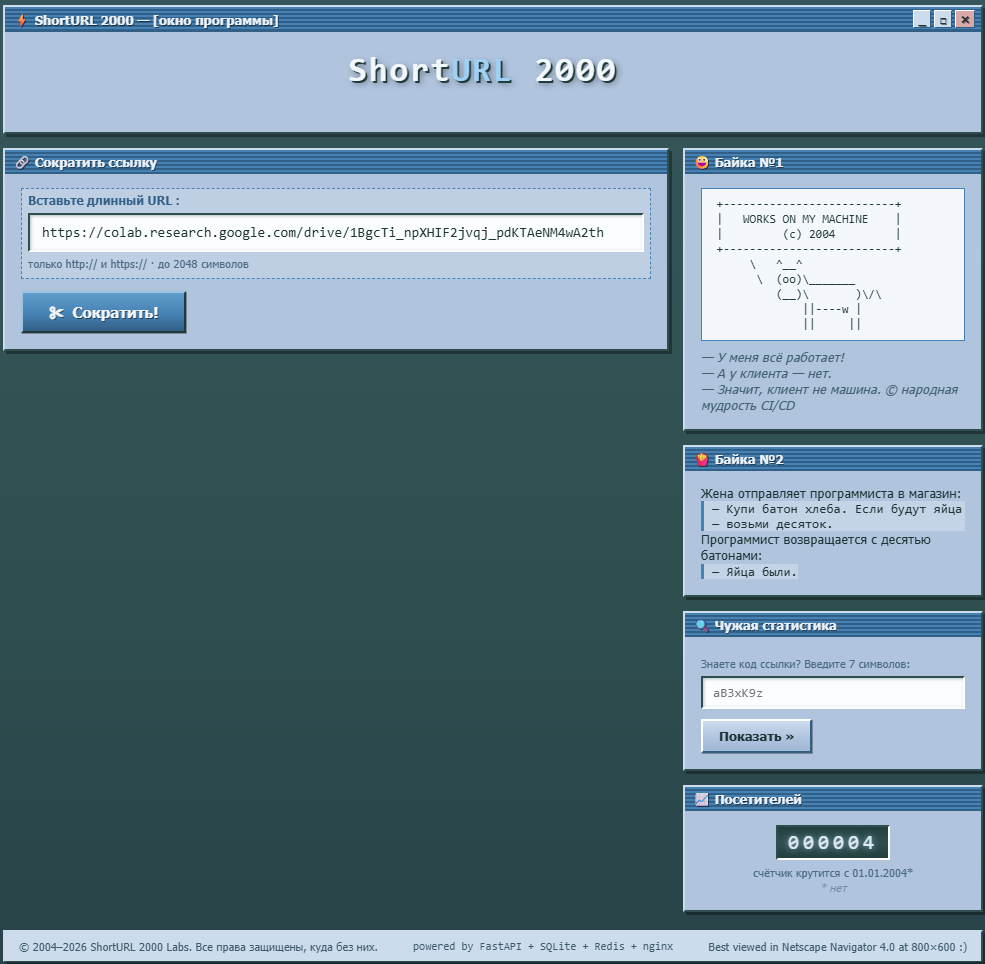

# URL shortener

Анонимный сокращатель URL: создаёт короткие ссылки, делает редирект на оригинальный URL и собирает статистику переходов с геолокацией. Разворачивается одной командой через Docker Compose (nginx + FastAPI + Redis + SQLite).



> Подробная архитектура, поток редиректа и принятые компромиссы — в [docs/ARCHITECTURE.md](docs/ARCHITECTURE.md).

## Требования
1. Создание короткой ссылки по длинному URL
2. Редирект по короткой ссылке на оригинальный URL
3. Сбор аналитики: количество переходов, геолокация
4. Без регистрации

## Интерфейс
Стиль 2000. Статистика урла в модалке. Добавить мем про программирование. Приглушенные, холодные тона. Вводные строчки с офигительной анимацией.

## Технологический стек

| Категория            | Выбор                                        | Комментарий                                              |
| -------------------- | -------------------------------------------- | -------------------------------------------------------- |
| Backend              | Python 3.12 + FastAPI (uvicorn)              | async, pydantic-валидация, автодокументация              |
| База данных          | SQLite (aiosqlite, режим WAL)                | файл на docker-томе, без отдельного сервера              |
| Кэш                  | Redis 7 (`redis-py` async, AOF)              | кэш редиректов и гео, деградация без потери данных       |
| Reverse proxy        | nginx 1.27                                   | единый вход :80, раздача статики, X-Forwarded-For        |
| Frontend             | Статические HTML/CSS/JS без сборки           | ванильный JS, стиль 2000-х                               |
| Базовые образы Docker| Alpine Linux                                 | python:3.12-alpine, nginx:1.27-alpine, redis:7-alpine    |
| Очередь AMQP         | ❌ не используется                           | для масштаба проекта избыточна — аналитика пишется сразу |

## API endpoints
Проектирование API  
| Endpoint                          | Метод | Описание                     |
| --------------------------------- | ----- | ---------------------------- |
| `/api/v1/links`                   | POST  | Создать короткую ссылку      |
| `/{short_code}`                   | GET   | Редирект на оригинальный URL |
| `/api/v1/links/{short_code}/stats`| GET   | Получить статистику          |
| `/api/v1/links/delete/{short_code}` | DELETE | Удалить ссылку             |

## Схема базы данных (примерная, адаптируй, упрости, дополни под sqlite)

```sql
CREATE TABLE links (
    id BIGSERIAL PRIMARY KEY,
    short_code VARCHAR(7) UNIQUE NOT NULL,
    original_url TEXT NOT NULL,
    created_at TIMESTAMP DEFAULT NOW(),
    expires_at TIMESTAMP
);

CREATE TABLE analytics (
    id BIGSERIAL PRIMARY KEY,
    link_id BIGINT REFERENCES links(id),
    clicked_at TIMESTAMP DEFAULT NOW(),
    ip_address INET,
    country VARCHAR(2)
);
CREATE INDEX idx_links_short_code ON links(short_code);
```

---

## Запуск

### Предварительные требования
* [Docker Desktop](https://www.docker.com/products/docker-desktop/) для Windows/macOS (или Docker Engine + Docker Compose v2 на Linux)
* Свободный порт **80** на хосте

### Запуск
```cmd
docker compose up -d --build
```

После старта приложение доступно по адресу: **http://localhost**

Проверить готовность (все сервисы должны быть `healthy`):
```cmd
docker compose ps
```

### Остановка
```cmd
docker compose down
```
Данные (SQLite-файл и AOF-кэш Redis) сохраняются в docker-томах и переживают перезапуск.

### Сброс данных
```cmd
docker compose down -v
```
Удаляет тома `sqlite-data` и `redis-data` — все ссылки и статистика будут стёрты.

### Публичный доступ через Cloudflare Quick Tunnel

Даёт публичный HTTPS-адрес для сервиса без проброса портов, настройки firewall и статического IP. URL живёт, пока работает процесс `cloudflared`. Регистрация не нужна.

**Вариант 1 — на хосте (Windows).** Установите cloudflared и запустите туннель (система должна быть запущена: `docker compose up -d`):
```cmd
winget install Cloudflare.cloudflared
cloudflared tunnel --url http://localhost:80
```
В консоли появится адрес вида `https://random-words-1234.trycloudflare.com` — им можно делиться. Остановка: `Ctrl+C` в консоли туннеля.

**Вариант 2 — без установки на хост:** добавьте сервис в `docker-compose.yml`:
```yaml
  tunnel:
    image: cloudflare/cloudflared:latest
    command: tunnel --url http://nginx:80
    restart: unless-stopped
    depends_on:
      nginx:
        condition: service_healthy
```
URL смотреть в логах (строка `https://....trycloudflare.com`):
```cmd
docker compose logs tunnel
```

**Примечания:**
* Веб-интерфейс подхватывает адрес туннеля автоматически (short-ссылки строятся от текущего origin).
* Если дергать API напрямую через туннель, поправьте `BASE_URL` в `docker-compose.yml` (или `.env`) на URL туннеля, чтобы поле `short_url` в ответах было корректным.
* ⚠️ Туннель открывает сервис всему интернету, авторизации нет — любой сможет удалять ссылки. Только для демо.

## Проверка API

Все примеры выполнялись реальными запросами (cmd.exe, curl). `short_code` подставляйте свой из ответа создания.

**1. Создать короткую ссылку** — `POST /api/v1/links` → 201:
```cmd
curl -s -X POST http://localhost/api/v1/links -H "Content-Type: application/json" -d "{\"original_url\":\"https://example.com/some/long/path\"}"
```
```json
{"short_code":"bLQxnZM","short_url":"http://localhost/bLQxnZM","original_url":"https://example.com/some/long/path","created_at":"2026-09-03 09:26:01"}
```

**2. Переход по короткой ссылке** — `GET /{short_code}` → 302 + Location:
```cmd
curl -s -i http://localhost/bLQxnZM
```
```
HTTP/1.1 302 Found
Location: https://example.com/some/long/path
```

**3. Статистика переходов** — `GET /api/v1/links/{short_code}/stats` → 200:
```cmd
curl -s http://localhost/api/v1/links/bLQxnZM/stats
```
```json
{"short_code":"bLQxnZM","original_url":"https://example.com/some/long/path","created_at":"2026-09-03 09:26:01","clicks":3,"countries":[{"country":"local","count":3}]}
```

**4. Удалить ссылку** — `DELETE /api/v1/links/delete/{short_code}` → 200, повторный GET → 404:
```cmd
curl -s -i -X DELETE http://localhost/api/v1/links/delete/bLQxnZM
curl -s -o nul -w "%{http_code}" http://localhost/bLQxnZM
```
```json
{"short_code":"bLQxnZM","deleted":true}
```

**Негативный сценарий** — не-URL в теле запроса → 422:
```cmd
curl -s -i -X POST http://localhost/api/v1/links -H "Content-Type: application/json" -d "{\"original_url\":\"not-a-url\"}"
```

## Стек и структура проекта

| Сервис | Образ | Порт | Назначение |
|---|---|---|---|
| nginx | nginx:1.27-alpine | **:80** (единственный вход снаружи) | reverse proxy, раздача статики `static/` |
| app | python:3.12-alpine | :8000 (только внутренняя сеть) | FastAPI: создание/редирект/статистика/удаление |
| redis | redis:7-alpine | :6379 (только внутренняя сеть) | кэш редиректов и гео-данных (AOF, LRU 128 MB) |
| — | — | том `sqlite-data` | база SQLite `/data/urlshortener.db` |

```
url_shorter/
├── app/                     # FastAPI-приложение
│   ├── main.py              # точка входа, lifespan, /api/v1/health
│   ├── links.py             # роутер: create / redirect / stats / delete
│   ├── models.py            # pydantic-схемы запросов и ответов
│   ├── database.py          # обёртка над SQLite (aiosqlite)
│   ├── cache.py             # Redis-кэш (redis-py)
│   ├── geo.py               # определение страны по IP (ip-api.com)
│   ├── shortcuts.py         # генерация short_code (base62, 7 символов)
│   └── config.py            # настройки из переменных окружения
├── static/                  # фронтенд (раздаётся nginx'ом напрямую)
│   ├── index.html
│   ├── css/style.css
│   └── js/app.js
├── nginx/
│   ├── nginx.conf           # проксирование API и коротких ссылок, статика
│   └── Dockerfile
├── docs/
│   └── ARCHITECTURE.md      # архитектурные решения
├── Dockerfile               # образ приложения (python:3.12-alpine)
├── docker-compose.yml       # app + redis + nginx, healthchecks, тома
├── requirements.txt
└── .env.example             # шаблон переменных окружения
```

## Переменные окружения

Значения по умолчанию заданы прямо в `docker-compose.yml`; при необходимости скопируйте `.env.example` в `.env` и переопределите (см. [docs/ARCHITECTURE.md](docs/ARCHITECTURE.md), раздел 7.3).

| Переменная | По умолчанию | Описание |
|---|---|---|
| `DATABASE_PATH` | `/data/urlshortener.db` | Путь к файлу SQLite на docker-томе |
| `REDIS_URL` | `redis://redis:6379/0` | Подключение к Redis |
| `GEO_API_URL` | `http://ip-api.com/json/{ip}?fields=status,countryCode` | Шаблон гео-запроса (`{ip}` подставляется автоматически) |
| `GEO_TIMEOUT_SECONDS` | `2` | Таймаут внешнего гео-запроса, сек |
| `CACHE_TTL_SECONDS` | `3600` | TTL кэша редиректов `url:{code}`, сек (1 час) |
| `GEO_CACHE_TTL_SECONDS` | `86400` | TTL кэша геолокации `geo:{ip}`, сек (24 часа) |
| `BASE_URL` | `http://localhost` | База для сборки `short_url` в ответах API |

## Варианты заданий

Распределение вариантов по участникам (данные функции в проекте не реализуются):

2. Сервис сокращения URL с генерацией QR-кодов — Бондаренко
3. Временные короткие ссылки — Лукина
5. Сервис сокращения URL с защитой паролем — Казаченко
9. Сервис с ограничением количества переходов — Гаранин
10. Сервис с монетизацией (реклама) — Кочетков
