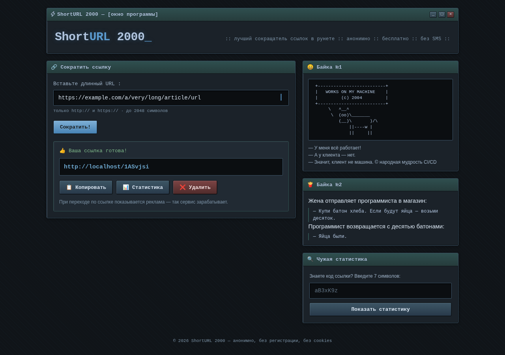

# URL shortener

Анонимный сокращатель URL: создаёт короткие ссылки, показывает перед переходом страницу с рекламой и собирает статистику переходов с геолокацией. Разворачивается одной командой через Docker Compose (nginx + Go + Python + Redis + SQLite).



> Подробная архитектура, поток редиректа и принятые компромиссы — в [docs/ARCHITECTURE.md](docs/ARCHITECTURE.md).

## Требования
1. Создание короткой ссылки по длинному URL
2. Редирект по короткой ссылке на оригинальный URL
3. Сбор аналитики: количество переходов, геолокация
4. Без регистрации
5. Монетизация: показ рекламы на странице перехода + статистика показов/кликов (вариант задания №10)

## Интерфейс
Стиль 2000. Статистика урла в модалке. Добавить мем про программирование. Приглушенные, холодные тона. Вводные строчки с офигительной анимацией.

Реализация: холодная приглушённая палитра (slate / steel blue / light steel на тёмном фоне, контраст не ниже WCAG AA), эпоха передана структурой и фактурой — bevel-рамки, «засечные» заголовки панелей, моноширинные коды, ASCII-байки про программистов, — а не копированием обоев Windows XP. Анимации: посимвольный placeholder (JS-интервал), свечение рамки при фокусе (CSS-переход), мигающий caret; всё это, включая посимвольную печать, отключается при `prefers-reduced-motion`. Страница перехода с рекламой использует ту же палитру и те же токены, что и главная.

## Технологический стек

| Категория            | Выбор                                        | Комментарий                                              |
| -------------------- | -------------------------------------------- | -------------------------------------------------------- |
| Backend (v2, боевой) | Go 1.27 (`net/http`, `html/template`)        | обслуживает API, короткие ссылки и страницу рекламы       |
| Backend (v1, legacy) | Python 3.12 + FastAPI (uvicorn)              | сохранён для сравнения, трафика не получает (см. ниже)     |
| База данных          | SQLite (`modernc.org/sqlite`, режим WAL)     | файл на docker-томе, общий для обоих сервисов             |
| Кэш                  | Redis 7 (`go-redis/v9`, AOF)                 | кэш редиректов и гео, деградация без потери данных        |
| Reverse proxy        | nginx 1.27                                   | единый вход :80, раздача статики, X-Forwarded-For         |
| Frontend             | Статические HTML/CSS/JS без сборки           | ванильный JS, стиль 2000-х                                |
| Базовые образы Docker| Alpine Linux                                 | golang:1.27-alpine, python:3.12-alpine, nginx, redis      |
| Очередь AMQP         | ❌ не используется                           | для масштаба проекта избыточна — аналитика пишется сразу  |

### Две реализации: v2 (Go) и v1 (Python, legacy)

Ветка `advertisement` добавила вторую, боевую реализацию API — на Go (`app/v2/`). Python-версия (`app/`, `/api/v1/`) сохранена без изменений и **трафика не получает**: nginx проксирует на неё только `/api/v1-legacy/`, который нужен для сверки поведения. Обе реализации работают с одним файлом SQLite на томе `sqlite-data`, поэтому одновременная запись в них — не штатный режим (см. [docs/ARCHITECTURE.md](docs/ARCHITECTURE.md), раздел 9).

## API endpoints

Активная (v2) схема — её использует фронтенд:

| Endpoint                            | Метод  | Описание                                    |
| ----------------------------------- | ------ | ------------------------------------------- |
| `/api/v2/links`                     | POST   | Создать короткую ссылку                     |
| `/{short_code}`                     | GET    | Страница перехода с рекламой → 200 + HTML   |
| `/api/v2/links/{short_code}/stats`  | GET    | Статистика переходов                        |
| `/api/v2/links/{short_code}/ads`    | GET    | Показы и клики по рекламе для этой ссылки   |
| `/api/v2/ads/stats`                 | GET    | Показы, клики и CTR по всем баннерам       |
| `/api/v2/links/delete/{short_code}` | DELETE | Удалить ссылку                              |
| `/api/v2/health`                    | GET    | Проверка БД и Redis                        |
| `/ad-click/{ad_key}`                | GET    | Клик по баннеру: учёт клика + `302` к рекламодателю |

Legacy (v1, только для сверки, трафика не получает): `/api/v1-legacy/*` → те же операции со старыми путями и **старой семантикой редиректа** (`302` + `Location`).

### Семантика редиректа изменилась

Раньше переход по короткой ссылке отвечал `302 Found` + `Location`. Сейчас `GET /{short_code}` отдаёт **`200 OK` + HTML-страницу** с рекламным баннером, таймером на 5 секунд и кнопкой «Продолжить», которая уже выполняет переход на оригинальный URL. Это сделано ради показа рекламы (вариант задания №10) — без промежуточной страницы показать баннер негде. Заголовки ответа: `Cache-Control: no-store`, `Referrer-Policy: no-referrer`, `X-Robots-Tag: noindex`.

Для программных сценариев, которым нужен «честный» редирект без рекламы, используйте `curl -H "Accept: application/json"`. Логика: клиент, который просит `application/json` или `*/*` (так отвечает curl по умолчанию) и **не** просит `text/html`, получает обычный `302`; браузер с `Accept: text/html,...` — страницу с рекламой.

## Реклама

* Баннеры лежат в `static/ads/` и раздаются nginx'ом.
* `static/ads/ad_images.txt` — пул: строка вида `<файл>|<ссылка>|<вес>`. Вес задаёт относительную частотность показа (по умолчанию 1). Файл перечитывается на каждый запрос, правки применяются без пересборки.
* `static/ads/ad_texts.txt` — подписи под баннером, по строке на файл.
* Шаблон страницы перехода — `app/v2/routing_page.html`, тоже подхватывается с диска (`ROUTING_PAGE_FILE`).
* Клик по баннеру идёт через `/ad-click/{ad_key}`, а не напрямую на сайт рекламодателя: только так считается CTR.

## Метрики рекламы

Показы и клики копятся в буфере в памяти и пачками пишутся в таблицу `ad_stats` каждые `AD_FLUSH_INTERVAL_SECONDS` (по умолчанию 5) и при остановке контейнера. Писать в SQLite на каждый редирект нельзя — файл базы общий с v1, лишние транзакции в горячем пути создают contention.

Смотреть агрегаты:

```cmd
curl -s http://localhost/api/v2/ads/stats
```
```json
{"ads":[{"ad_key":"altman.jpg","impressions":120,"clicks":9,"ctr":0.075},{"ad_key":"cpp.jpg","impressions":80,"clicks":2,"ctr":0.025}],"total_impressions":200,"total_clicks":11,"ctr":0.055}
```

## Тесты

Тесты Go-реализации (`app/v2`) запускаются без Docker — SQLite во временном файле, Redis поднимается в процессе (`miniredis`):

```cmd
cd app/v2
go test ./...
```

Покрыты: генерация и валидация `short_code`, CRUD эндпоинтов и коды ошибок, определение приватного IP и кэш гео, разбор `ad_images.txt` и веса баннеров, шаблон страницы перехода (включая экранирование), учёт показов/кликов и агрегаты.

## Схема базы данных (фактическая, `app/v2/db.go`)

```sql
CREATE TABLE links (
    id           INTEGER PRIMARY KEY AUTOINCREMENT,
    short_code   TEXT    NOT NULL UNIQUE,
    original_url TEXT    NOT NULL,
    created_at   TEXT    NOT NULL DEFAULT (datetime('now'))
);

CREATE TABLE analytics (
    id         INTEGER PRIMARY KEY AUTOINCREMENT,
    link_id    INTEGER NOT NULL REFERENCES links(id) ON DELETE CASCADE,
    clicked_at TEXT    NOT NULL DEFAULT (datetime('now')),
    ip_address TEXT,
    country    TEXT
);

-- Накопленные счётчики рекламы; link_id = 0 — сквозной итог по баннеру.
CREATE TABLE ad_stats (
    ad_key     TEXT    NOT NULL,
    event_type TEXT    NOT NULL,   -- impression | click
    link_id    INTEGER NOT NULL,
    count      INTEGER NOT NULL DEFAULT 0,
    updated_at TEXT    NOT NULL DEFAULT (datetime('now')),
    PRIMARY KEY (ad_key, event_type, link_id)
);
```

От исходного задания отличаются: `id INTEGER PRIMARY KEY AUTOINCREMENT` вместо `BIGSERIAL`, текстовые даты вместо `TIMESTAMP`, `ip_address TEXT` вместо `INET`, а `analytics` хранит только страну, а не сырой IP. Поле `expires_at` не используется — варианты заданий №3 и №9 (временные ссылки, лимит переходов) в этом проекте не реализуются.

---

## Запуск

### Предварительные требования
* [Docker Desktop](https://www.docker.com/products/docker-desktop/) для Windows/macOS (или Docker Engine + Docker Compose v2 на Linux)
* Свободный порт **80** на хосте

### Запуск
```cmd
docker compose up -d --build
```

После старта приложение доступно по адресу: **http://localhost**

Проверить готовность (все сервисы должны быть `healthy`):
```cmd
docker compose ps
```

### Остановка
```cmd
docker compose down
```
Данные (SQLite-файл и AOF-кэш Redis) сохраняются в docker-томах и переживают перезапуск.

### Сброс данных
```cmd
docker compose down -v
```
Удаляет тома `sqlite-data` и `redis-data` — все ссылки и статистика будут стёрты.

### Публичный доступ через Cloudflare Quick Tunnel

Даёт публичный HTTPS-адрес для сервиса без проброса портов, настройки firewall и статического IP. URL живёт, пока работает процесс `cloudflared`. Регистрация не нужна.

**Вариант 1 — на хосте (Windows).** Установите cloudflared и запустите туннель (система должна быть запущена: `docker compose up -d`):
```cmd
winget install Cloudflare.cloudflared
cloudflared tunnel --url http://localhost:80
```
В консоли появится адрес вида `https://random-words-1234.trycloudflare.com` — им можно делиться. Остановка: `Ctrl+C` в консоли туннеля.

**Вариант 2 — без установки на хост:** добавьте сервис в `docker-compose.yml`:
```yaml
  tunnel:
    image: cloudflare/cloudflared:latest
    command: tunnel --url http://nginx:80
    restart: unless-stopped
    depends_on:
      nginx:
        condition: service_healthy
```
URL смотреть в логах (строка `https://....trycloudflare.com`):
```cmd
docker compose logs tunnel
```

**Примечания:**
* Веб-интерфейс подхватывает адрес туннеля автоматически (short-ссылки строятся от текущего origin).
* Если дергать API напрямую через туннель, поправьте `BASE_URL` в `docker-compose.yml` (или `.env`) на URL туннеля, чтобы поле `short_url` в ответах было корректным.
* ⚠️ Туннель открывает сервис всему интернету, авторизации нет — любой сможет удалять ссылки. Только для демо.

## Проверка API

Примеры для активной (v2) схемы. `short_code` подставляйте свой из ответа создания.

**1. Создать короткую ссылку** — `POST /api/v2/links` → 201:
```cmd
curl -s -X POST http://localhost/api/v2/links -H "Content-Type: application/json" -d "{\"original_url\":\"https://example.com/some/long/path\"}"
```
```json
{"short_code":"bLQxnZM","short_url":"http://localhost/bLQxnZM","original_url":"https://example.com/some/long/path","created_at":"2026-09-03 09:26:01"}
```

**2. Переход по короткой ссылке** — `GET /{short_code}`. В браузере отдаётся страница рекламы, curl получает обычный редирект (по умолчанию curl шлёт `Accept: */*`):
```cmd
curl -s -i http://localhost/bLQxnZM
```
```
HTTP/1.1 302 Found
Location: https://example.com/some/long/path
Cache-Control: no-store
```

Тот же запрос с `Accept: text/html` вернёт страницу с баннером:
```cmd
curl -s -H "Accept: text/html" http://localhost/bLQxnZM
```

**3. Статистика переходов** — `GET /api/v2/links/{short_code}/stats` → 200:
```cmd
curl -s http://localhost/api/v2/links/bLQxnZM/stats
```
```json
{"short_code":"bLQxnZM","original_url":"https://example.com/some/long/path","created_at":"2026-09-03 09:26:01","clicks":3,"countries":[{"country":"local","count":3}]}
```

**4. Реклама по ссылке и по всем баннерам**:
```cmd
curl -s http://localhost/api/v2/links/bLQxnZM/ads
curl -s http://localhost/api/v2/ads/stats
```

**5. Удалить ссылку** — `DELETE /api/v2/links/delete/{short_code}` → 200, повторный GET → 404:
```cmd
curl -s -i -X DELETE http://localhost/api/v2/links/delete/bLQxnZM
curl -s -o nul -w "%{http_code}" http://localhost/bLQxnZM
```
```json
{"short_code":"bLQxnZM","deleted":true}
```

**Негативный сценарий** — не-URL в теле запроса → 422:
```cmd
curl -s -i -X POST http://localhost/api/v2/links -H "Content-Type: application/json" -d "{\"original_url\":\"not-a-url\"}"
```

**Legacy-пути** (Python v1, старая семантика редиректа) доступны под префиксом `/api/v1-legacy/` и снаружи не проксируются на страницы рекламы:
```cmd
curl -s -i http://localhost/api/v1-legacy/links/bLQxnZM
```

## Стек и структура проекта

| Сервис | Образ | Порт | Назначение |
|---|---|---|---|
| nginx | nginx:1.27-alpine | **:80** (единственный вход снаружи) | reverse proxy, раздача статики `static/` |
| v2 | golang:1.27-alpine | :8000 (только внутренняя сеть) | Go: API v2, короткие ссылки, страница рекламы, клики по баннерам |
| app | python:3.12-alpine | :8000 (только внутренняя сеть) | FastAPI v1, legacy: трафика не получает |
| redis | redis:7-alpine | :6379 (только внутренняя сеть) | кэш редиректов и гео-данных (AOF, LRU 128 MB) |
| — | — | том `sqlite-data` | база SQLite `/data/urlshortener.db`, общая для `v2` и `app` |

```
url_shortener/
├── app/
│   ├── v2/                   # Go-приложение (активное)
│   │   ├── main.go           # точка входа, конфиг, graceful shutdown
│   │   ├── api.go            # роутер и обработчики: create / redirect / stats / delete / health
│   │   ├── ads.go            # баннеры: разбор ad_images.txt, веса, учёт показов и кликов
│   │   ├── db.go             # схема SQLite и обёртка над БД
│   │   ├── cache.go          # Redis-кэш (go-redis/v9)
│   │   ├── geo.go            # определение страны по IP (ip-api.com)
│   │   ├── routing_page.html # шаблон страницы перехода с рекламой
│   │   ├── shortcuts/        # генерация short_code (base58, 7 символов)
│   │   └── Dockerfile        # multi-stage, статический бинарник, non-root
│   ├── main.py               # v1 (legacy) FastAPI: точка входа, /api/v1/health
│   ├── links.py              # v1 роутер: create / redirect / stats / delete
│   ├── models.py             # pydantic-схемы v1
│   ├── database.py           # обёртка над SQLite (aiosqlite)
│   ├── cache.py              # Redis-кэш v1 (redis-py)
│   ├── geo.py                # геолокация v1
│   ├── shortcuts.py          # генерация short_code v1
│   └── config.py             # настройки v1 из переменных окружения
├── static/                   # фронтенд (раздаётся nginx'ом напрямую)
│   ├── index.html
│   ├── css/style.css
│   ├── js/app.js
│   └── ads/                  # баннеры + ad_images.txt + ad_texts.txt
├── nginx/
│   ├── nginx.conf            # проксирование API, коротких ссылок, /ad-click/, статика
│   └── Dockerfile
├── docs/
│   └── ARCHITECTURE.md       # архитектурные решения
├── Dockerfile                # образ v1 (python:3.12-alpine)
├── docker-compose.yml        # v2 + app + redis + nginx, healthchecks, тома
├── requirements.txt
└── .env.example              # шаблон переменных окружения
```

## Переменные окружения

Значения по умолчанию заданы прямо в `docker-compose.yml`; при необходимости скопируйте `.env.example` в `.env` и переопределите (см. [docs/ARCHITECTURE.md](docs/ARCHITECTURE.md), раздел 7.3).

| Переменная | По умолчанию | Описание |
|---|---|---|
| `DATABASE_PATH` | `/data/urlshortener.db` | Путь к файлу SQLite на docker-томе. **Одинаков для `v2` и `app`** |
| `REDIS_URL` | `redis://redis:6379/0` | Подключение к Redis |
| `GEO_API_URL` | `http://ip-api.com/json/{ip}?fields=status,countryCode` | Шаблон гео-запроса (`{ip}` подставляется автоматически) |
| `GEO_TIMEOUT_SECONDS` | `2` | Таймаут внешнего гео-запроса, сек |
| `CACHE_TTL_SECONDS` | `3600` | TTL кэша редиректов `url:{code}`, сек (1 час) |
| `GEO_CACHE_TTL_SECONDS` | `86400` | TTL кэша геолокации `geo:{ip}`, сек (24 часа) |
| `BASE_URL` | `http://localhost` | База для сборки `short_url` в ответах API |
| `AD_IMAGES_FILE` | `/static/ads/ad_images.txt` | Пул баннеров: `<файл>|<ссылка>|<вес>` |
| `AD_TEXTS_FILE` | `/static/ads/ad_texts.txt` | Подписи под баннером, по строке на файл |
| `AD_FLUSH_INTERVAL_SECONDS` | `5` | Период сброса буфера метрик рекламы в SQLite, сек |
| `ROUTING_PAGE_FILE` | `/templates/routing_page.html` | Шаблон страницы перехода с диска |

## Варианты заданий

Распределение вариантов по участникам (данные функции в проекте не реализуются):

2. Сервис сокращения URL с генерацией QR-кодов — Бондаренко
3. Временные короткие ссылки — Лукина
5. Сервис сокращения URL с защитой паролем — Казаченко
9. Сервис с ограничением количества переходов — Гаранин
10. Сервис с монетизацией (реклама) — Кочетков
